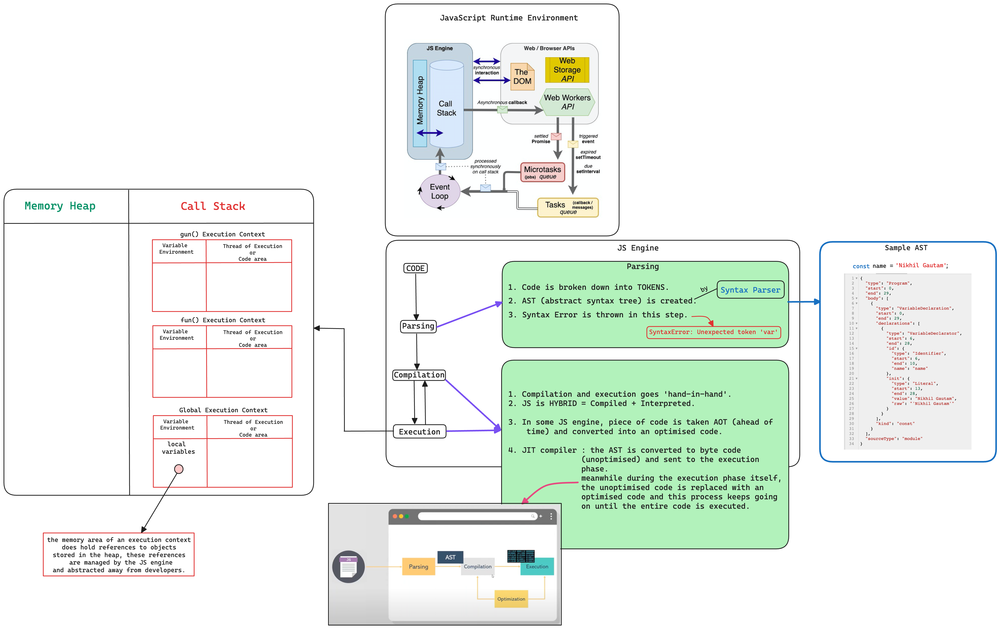

# How JS parses the code ??

-   JS is not interpreted, it is `Hybrid` ie. `compiled + interpreted`.
-   `Phase 1` = parsing ---> `Phase 2` = execution.
-   So, whenever we try to execute a JS code,
    1. JS first parses the whole code, in this parsing phase it assigns `scopes` to `variables/functions` and not values of the variable.
    2. once done it then reads the code and executes it.

## Note :-

-   Every variable in our code is used in one of following ways.

    1. as a `target` - getting a value assigned.
        - eg :- `x = 10;`
    2. as a `source` - used to retrieve a value.
        - eg :- ` "console.log(x);"  or  "y = 10 + x;"  or  "fun();" ; (here 'x' is used to retrieve a value.)`

-   JS maintains a `Global Scope` for everything outside a function while parsing, but the moment it
    enters a function it starts maintaing the `scope of that function`.
-   It looks for `Formal Declarations` during this phase.
    -   `Formal Declaration` :
        -   whenever we declare a variable using var/let/const it is a formal declaration.
        -   Initializing a function is also a formal declaration.

# JS Runtime Engine :-

