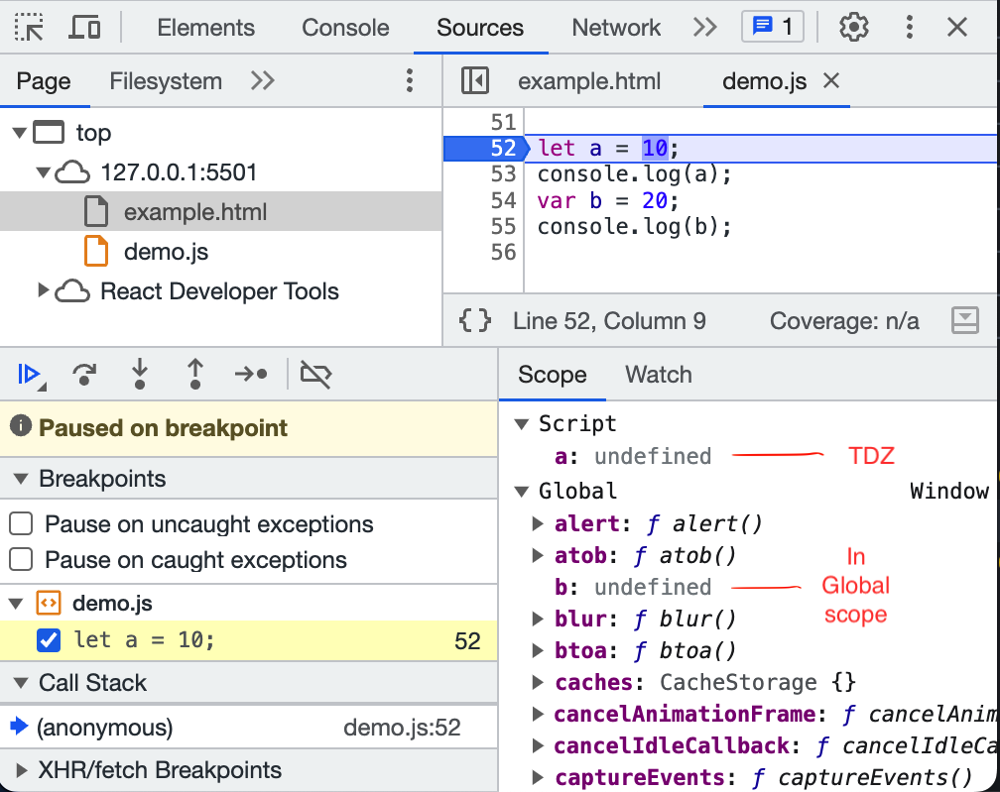

# TDZ (Temporal Dead Zone) :-

-   TDZ is the time since when the (let, const) variable is hoisted and till they are initialised any value.
-   

# `let` vs `var` vs `const` :-

-   Formal Declaration : declaration using `var`, `let`, `const` is a formal declaration.
-   All three (var, let, const) are hoisted. they all are allocated memory at the begining(in phase 1 of execution).
    -   but the (let, const) are actually in the `TDZ` for the time being(until assigned any value | initialization).
    -   they also get `undefined` assigned to it, but since they remain in TDZ so they become inaccessible.
    -   Once they are initialised with a value, they get out of the TDZ and hence we are able to access the variable values.

## **_`var`_** :-

-   Hoisted but has value as `undefined` unless initialised.
-   The var statement declares a `function-scoped` or `globally-scoped` variable, optionally initializing it to a value.
-   Inside a function `var` gets `function scope` whether it is inside a block or not.
-   var allows redeclaration.

```js
// Inside a "function" var will always get the function scope whether it is inside a block or not.
consumer = 'nikhil';
function p() {
    console.log(consumer); // undefined
    if (consumer == 'nikhil') {
        var consumer = 'gautam';
        console.log(consumer);
    }
    console.log(consumer); // undefined
}
p();
```

-   Oustside a function, even if it is inside any block, it will have `global scope`.
-   eg 1 :-

```JS
console.log(x); // "undefined" --> bcz of `lexical Scoping` and `Hoisting`
console.log(y); // "undefined" --> bcz of `lexical Scoping` and `Hoisting`
console.log(m); // "undefined" --> bcz of `lexical Scoping` and `Hoisting`

function fun() {
    console.log('x inside fun() - ', x); // undefined
    console.log(z); // "undefined" --> bcz of `lexical Scoping` and `Hoisting`
    var z = 50;
    console.log(z);
}
fun();
// console.log(z);     // ReferenceError: z is not defined

{
    var x = 10;
    console.log(x); // 10
}
console.log(x); // 10

if (true) {
    var y = 20;
    console.log(y); // 20
}
console.log(y); // 20
if (false) {
    var m = 30;
    console.log(m);
}
console.log(m); // undefined
```

-   eg 2 :-

```js
function test() {
    for (var i = 0; i < 3; i++) {
        setTimeout(function exec() {
            console.log(`i : ${i}`);
        }, i * 1000);
    }
}
test();
// OUTPUT :
// i : 3
// i : 3
// i : 3

// Reason : here closure remembers the function scope of variable 'i' bcz of 'var'.
//          every time a new block is created.
```

-   eg 3:-

```js
var a = 15;
var a = 25; // var allows redeclaration.
console.log(a); // 25
```

## **_`let`_** :-

-   Hoisted but stays in TDZ unless initialised.
-   The `let` declaration always declares a `block-scoped` local variable.
-   If we declare `let` outside any block, it still won't get complete global scope.
-   let does not allow redeclaration.

-   eg 1:-

```JS
{
    let x = 10;
    console.log(x);
}
// console.log(x);     // ReferenceError: x is not defined

function fun() {
    // console.log(y);     // ReferenceError: y is not defined
    let y = 20;
    console.log(y);
}
fun();
// console.log(y);     // ReferenceError: y is not defined

// ----------------------------------XXXXXXXXXX------------------------------------------ //

let a = 15;
// let a = 25;      // let does not allow redeclaration.
                    //        - "SyntaxError: Identifier 'a' has already been declared"

// ----------------------------------XXXXXXXXXX------------------------------------------ //

// `let` will not give complete global scope if declared outside any block, unlike `var`.
// console.log(d);     // ReferenceError: Cannot access 'd' before initialization
let d = "nikhil";
```

-   eg 2:-

```js
function test_1() {
    for (let i = 0; i < 3; i++) {
        setTimeout(function exec() {
            console.log(`i : ${i}`);
        }, i * 1000);
    }
}
// test_1();
// OUTPUT :
// i : 0
// i : 1
// i : 2

// Reason : here closure remembers the block scope of variable 'i' bcz of 'let'.
//          every time a new block is created. everytime the loop runs a new block is created
//          and the value of 'i' is different in each block.
// above code is same as :-
function test_2() {
    for (var i = 0; i < 3; i++) {
        let j = i;
        setTimeout(function exec() {
            console.log(`j : ${j} ---- i : ${i}`);
        }, i * 1000);
    }
}
test_2();
// OUTPUT :
// j : 0 ---- i : 3
// j : 1 ---- i : 3
// j : 2 ---- i : 3
// Reason : here closure remembers the block scope of variable 'j' bcz of 'let'.
//          every time a new block is created. everytime the loop runs a new block is created
//          and the value of 'j' is different in each block. And 'i' is function scope.

// without using let :-
function test_3() {
    for (var i = 0; i < 3; i++) {
        function wrap(x) {
            setTimeout(() => {
                console.log(x, i);
            }, i * 1000);
        }
        wrap(i);
    }
}
test_3();
// 0 3
// 1 3
// 2 3
```

-   eg 3:- redeclaration not allowed.

```js
let a = 15;
// let a = 25;      // let does not allow redeclaration.
//        - "SyntaxError: Identifier 'a' has already been declared"
```

## **_`const`_** :-

-   Hoisted but stays in TDZ unless initialised.
-   Block-scoped just like let.
-   need to initialize at time of declaration.
-   cannot be reassigned any value.
-   cannot be redeclared.
-   However, if a constant is an object or array its properties or items can be updated or removed.
-   eg :-

```js
// -   Hoisted but stays in TDZ unless initialised.
console.log(a); // ReferenceError: Cannot access 'a' before initialization
const a = 10;
// -   Block-scoped just like let.
function fun() {
    for (var i = 0; i < 3; i++) {
        const j = i;
        setTimeout(() => {
            console.log(j);
        }, i * 1000);
    }
}
fun();
// 0
// 1
// 2

// -   need to initialize at time of declaration.
const b; // SyntaxError: Missing initializer in const declaration
b = 20;


// -   cannot be reassigned any value.
const c = 10;
c = 20; // TypeError: Assignment to constant variable.


// -   cannot be redeclared.
const d = 25;
const d = 15; // SyntaxError: Identifier 'd' has already been declared


// -   However, if a constant is an object or array its properties or items can be updated or removed.
const obj = {
    fname: 'nikhil',
    lname: 'gautam'
}
console.log('before', obj); // before { fname: 'nikhil', lname: 'gautam' }
obj.fname = 'aditya';
console.log('after', obj); // after { fname: 'aditya', lname: 'gautam' }
```
