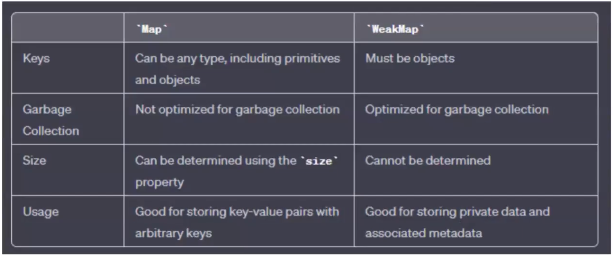

# Maps in JS :-

1. Map is class defined in JS.
2. `Datatype of Map is = function`. ( datatype of class in JS is function).
3. Holds `key-value` pairs where the `keys can be of any datatype`,
   unlike in Objects where keys can be either String or Symbol.
4. Map remembers the original insertion order of the keys.
5. Has a property that remembers the `size` of the map.
6. Maps are `Iterable` unlike objects that are not inherently iterable.

# Weak Maps :-

1. `Keys must be Objects` in a weakMap and the values can be of any type.
2. The key `object references are weakly held` :
    - which means that if the key object is no longer referenced anywhere else, it can be garbage collected, along with its associated value in weakMap.

# Map vs WeakMap :-

