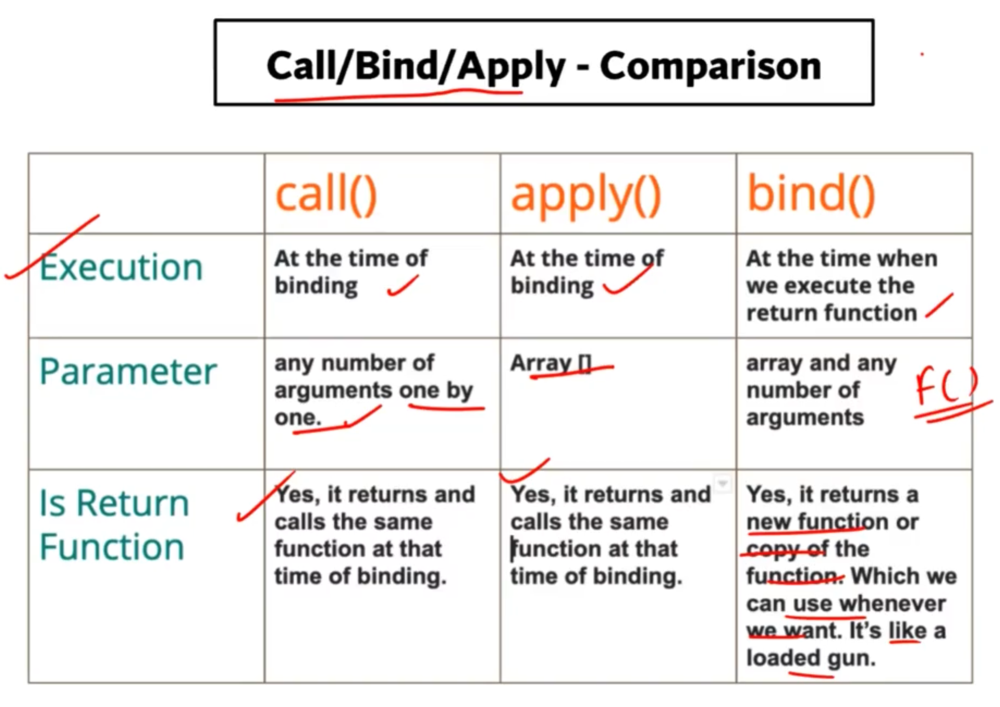

# apply() in JS :-

-   
-   SYNTAX :

```js
apply(thisArg);
apply(thisArg, argsArray);
// [function_name].apply(thisArgument, argsArray)
```

-   `thisArgument` : whichever object we pass as thisArgument will be used as `this` .

-   Return value : The result of calling the function with the specified this value and arguments.

-   eg :-

```js
// 1
// Using apply() to append an array to another
const array1 = ['a', 'b'];
const elements1 = [0, 1, 2];
array1.push.apply(array1, elements1);
console.info(array1); // ["a", "b", 0, 1, 2]

// The same effect can be achieved with the spread syntax.
const array2 = ['a', 'b'];
const elements2 = [0, 1, 2];
array2.push(...elements2);
console.info(array2); // ["a", "b", 0, 1, 2]

// 2
// Using apply() and built-in functions
const numbers = [5, 6, 2, 3, 7];

// using Math.min/Math.max apply
let max = Math.max.apply(null, numbers); // 7
// This about equal to Math.max(numbers[0], …)
// or Math.max(5, 6, …)

let min = Math.min.apply(null, numbers); // 2
// same using spread syntax.
console.log(Math.max(...numbers)); // 2
console.log(Math.min(...numbers)); // 7
```
