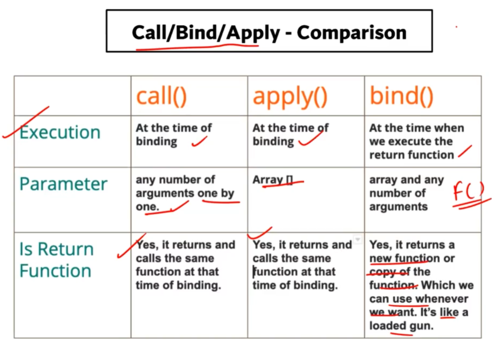

# bind() in JS :-

-   
-   SYNTAX :

```js
bind(thisArg);
bind(thisArg, arg1);
bind(thisArg, arg1, arg2);
bind(thisArg, arg1, arg2, /* …, */ argN);
// [function_name].bind(thisArgument, ...arrayOfArguments)
```

-   `thisArgument` : whichever object we pass as thisArgument will be used as `this` .
