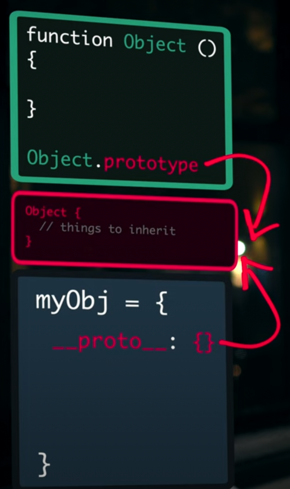
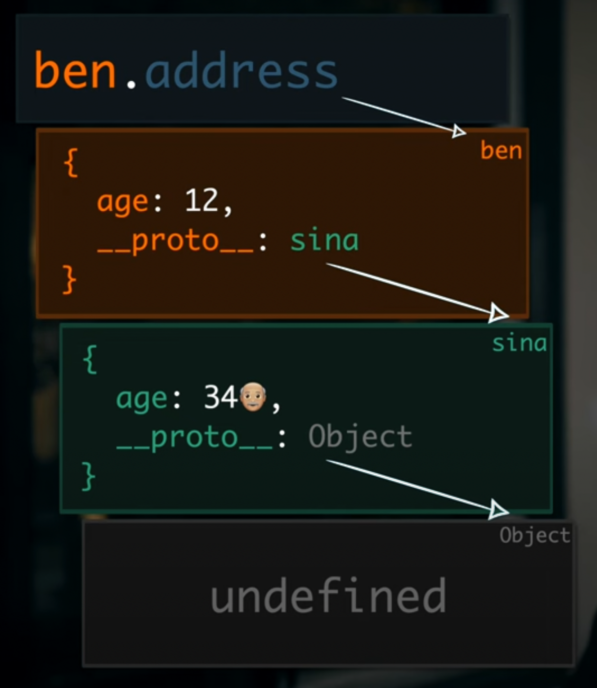

# Objects in JAVA vs JS :-

-   objects in Java are not inherently dynamic in the sense that their structure and behavior cannot be modified at runtime. Once an object is instantiated from a class, its properties and methods are determined by the class definition and cannot be changed during the execution of the program.

-   However, it's worth noting that objects in Java can still be considered dynamic in terms of their state, meaning that the values of their properties can be modified throughout the program execution. The object's state can change based on various factors and interactions with other objects or operations within the program.

-   On the other hand, in JavaScript, objects are inherently dynamic as their properties and methods can be modified or added at runtime. JavaScript objects are mutable, and you can add, remove, or modify properties and methods freely, allowing for dynamic changes to their structure and behavior.

# Prototype :-

-   Objects don't have `prototype` property, only `Constructor Functions` and `Classes` have.
-   Objects have `__proto__` (dunder proto).
-   It is a mechanism using which JS objects inherits features from one another.
-   It is a property which also is actually an object.
-   `If we make changes to the prototype of an (function/Class)object, it will reflect on the already created objects of that class/function as well, during runtime`.
-   
-   eg :-

```js
function Product(n) {
    this.name = 'Nikhil';
}

let d = new Product('iphone');
Product.prototype.display = () => console.log('Hey I am added during runtime.');

d.display(); // Hey I am added during runtime.
console.log(d.__proto__ === Product.prototype); // true
```
