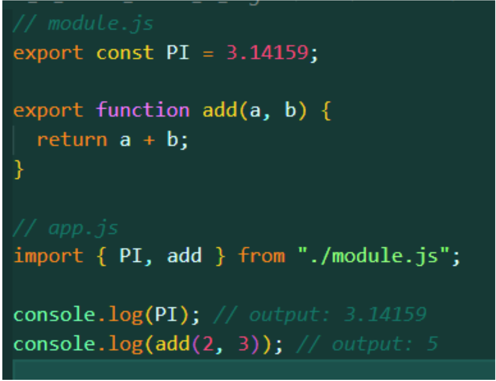
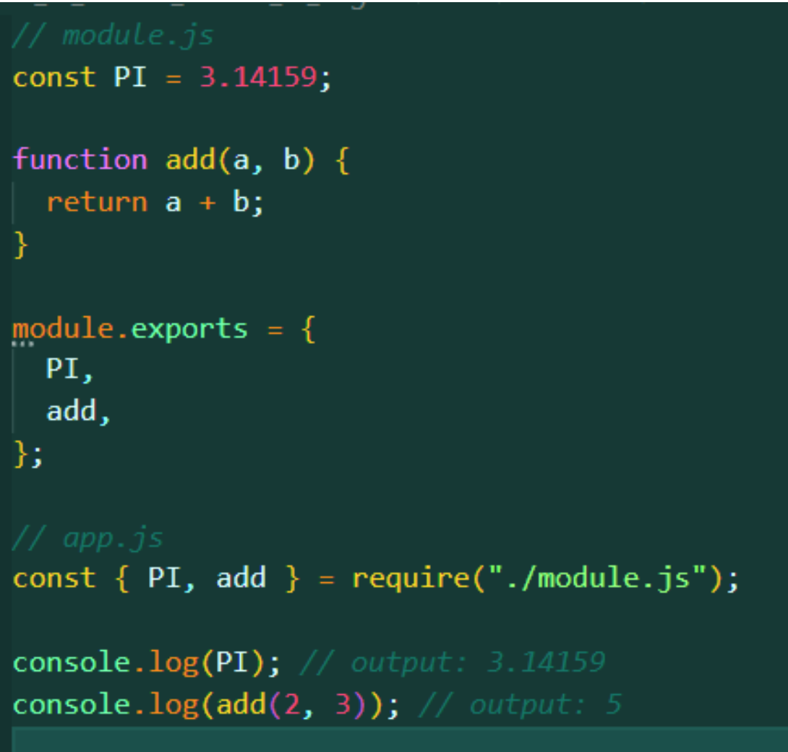

# Modules in JS :-

-   JavaScript modules are a way of organizing and structuring code in separate files, which can then be imported and used in other parts of your application.
-   Modules help to improve code organization, reduce duplication, and increase reusability.
-   Modules are implemented in modern JavaScript using the import and export statements.

## 3 Ways of writing modules :-

1. `ES6 Modules`

    - To use a module in another file, you need to import it using the import statement.
    - You can import named exports by enclosing them in curly braces {} and specifying the name of the export.
    - 

2. `CommonJS ( Prior to ES6)`
    - Prior to ES6, the most common way of implementing modules in JavaScript was through the CommonJS standard.
    - CommonJS modules use the require() function to import modules and module.exports to export them.
    - 
3. `AMD Modules( Legacy)`

## Why `ES-6 module` over `Common JS module` :

1. `Standardization`:

    - One of the primary motivations behind ES6 modules was to standardize module syntax and behavior across JavaScript environments (browsers and Node.js). CommonJS modules were primarily designed for server-side use, and there were different module systems and loaders for browsers. ES6 modules aimed to establish a single, unified module system for both environments.

2. `Static Analysis`:

    - ES6 modules support static analysis, meaning that module dependencies can be determined at compile-time. This allows tools and bundlers to optimize code, tree-shake unused exports, and perform dead code elimination more effectively. CommonJS modules use dynamic require statements, which make it harder for tools to analyze dependencies at build time.

3. `Tree Shaking`:

    - `When we import and export modules in JavaScript, most of the time there is unused code floating around. Tree shaking or dead code elimination means that unused modules will not be included in the bundle during the build process.`
    - ES6 modules introduced a concept called "tree shaking," which is a way to eliminate unused code from the final bundle. This is possible because of the static nature of ES6 modules. With CommonJS modules, it's more challenging to perform tree shaking because imports are resolved at runtime.

4. `Named Exports and Imports`:

    - ES6 modules provide a more fine-grained control over exports and imports. You can have multiple named exports from a module and selectively import them by name in other modules. CommonJS modules primarily use a single module.exports object, which doesn't offer the same level of granularity.

5. `Asynchronous Loading`:

    - ES6 modules can be loaded asynchronously using the import statement with promises. This is particularly useful for optimizing the loading of resources in web applications. CommonJS modules are inherently synchronous, making it harder to achieve efficient asynchronous loading.

6. `Browser Support`:

    - While CommonJS modules worked well in Node.js, they weren't natively supported in browsers. Developers had to rely on bundlers like Browserify or webpack to make CommonJS modules work in the browser. ES6 modules, on the other hand, were designed with native browser support in mind.

7. `Backward Compatibility`:
    - ES6 modules allow for better backward compatibility with older module systems, including CommonJS and AMD (Asynchronous Module Definition). This means you can still use existing modules while gradually transitioning to ES6 modules.
