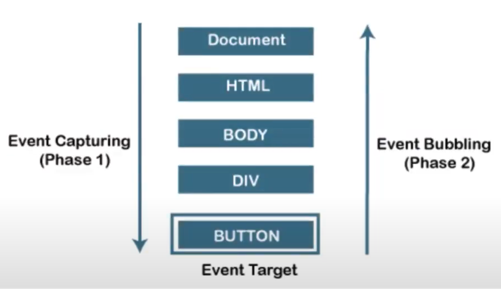

# `VVIMP` :

-   **_ Event propagation is a phenopmenon, while event Delegation is a technique/strategy. _**

# Event propagation :

-   There are 2 ways of event propagation in the HTML DOM;
    1. Bubbling
    2. Capturing.
-   SYNTAX : <b style="color:rgb(205, 152, 254);">addEventListener(event, <em>function</em>, useCapture)</b>
-   
-   **_`First Capturing Happens, then Bubbling happens when we nest both of them togther.`_**
-   By default `useCapture = false`. ie: bubbling is enabled by default.

## 1. Event Bubbling :

-   It is the process by which an event travels from the deepest child element that triggered the event, up to the document root.
-   Even though event travels from

## 2. Event Capturing :

-   It is the process of capturing an event as it travels from top to down the DOM tree, from the outermost element till the target element.

# Event Delegation :

-   It is a technique that involves `attaching event listeners to a parent element instead of individual child elements.`
-   When an event occurs on a child element, `the event bubbles up to the parent element where the event listener is triggered.`
-   This technique `can improve perfomance and reduce memory consumption` when working with `a large number of child elements.`
