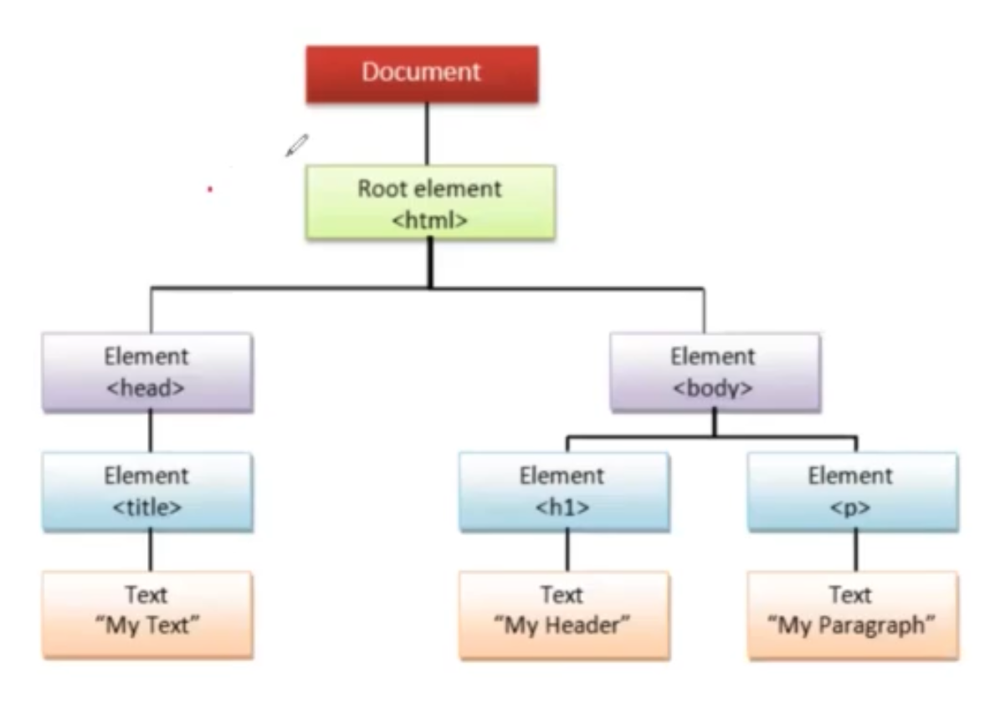

# DOM :-

-   The browser creates a `Document Object Model` of the page when it loads.
-   DOM is a `tree of objects`.
-   It defines `properties, methods, events` for all the HTML elements.
-   

# JS DOM :-

-   It can ;
    1. change all HTML elements.
    2. change all HTML attributes.
    3. change all the CSS styles.
    4. remove existing HTML elements.
    5. add new HTML elements.
    6. react to all existing HTML events in the page : LISTEN.
    7. create new HTML events.

# Document Object :-

-   The document object represents your web page.

# Accessing elements in web page :-

-   Always start with accessing the document object first.
-   eg :-

```js
<script>document.getElementById('demo').innerHTML = 'I am Nikhil';</script>
```

-   Different ways to acces elements in a webpage.
    1. document.getElementById()
    2. document.getElementsByClassName()
    3. document.getElementsByTagName()
    4. document.getElementByClassName()
    5. document.querySelector()
    6. document.querySelectorAll()
