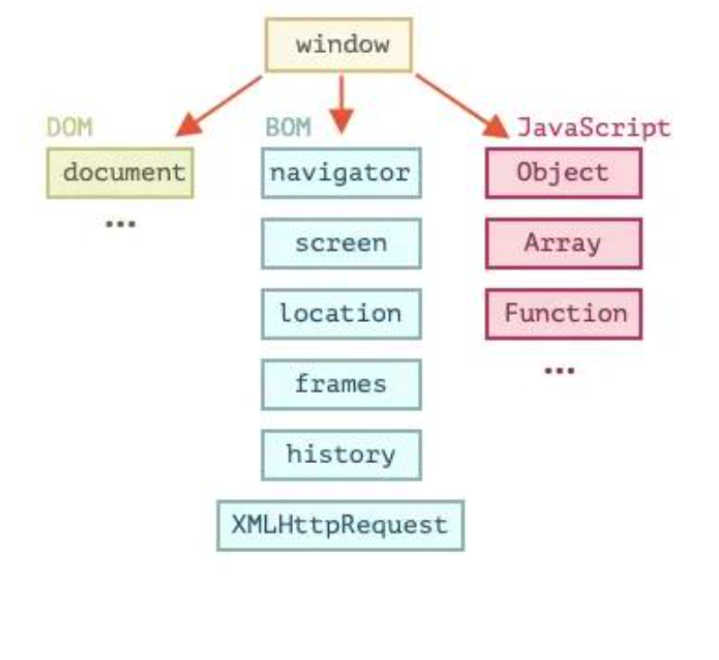

# BOM :

-   

-   How browser communicates to the web application, what connects both ?
    -   `Window` object.
-   Browser Object Model allows JS to talk to the browser.

# Window object :

-   The window object is supported by all browsers. It represents the browser's window.
-   The object at the root of the web browser is window.
-   All global JS Objects, Functions and Variables automatically become member of the window object.
-   `Every Browser Tab has it’s own window object.`
-   The Browser Object Model (BOM) allows JavaScript to "talk to" the browser.
